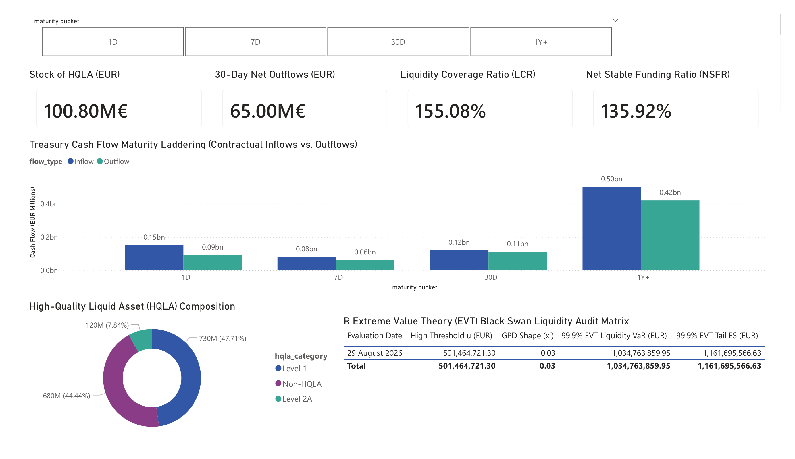
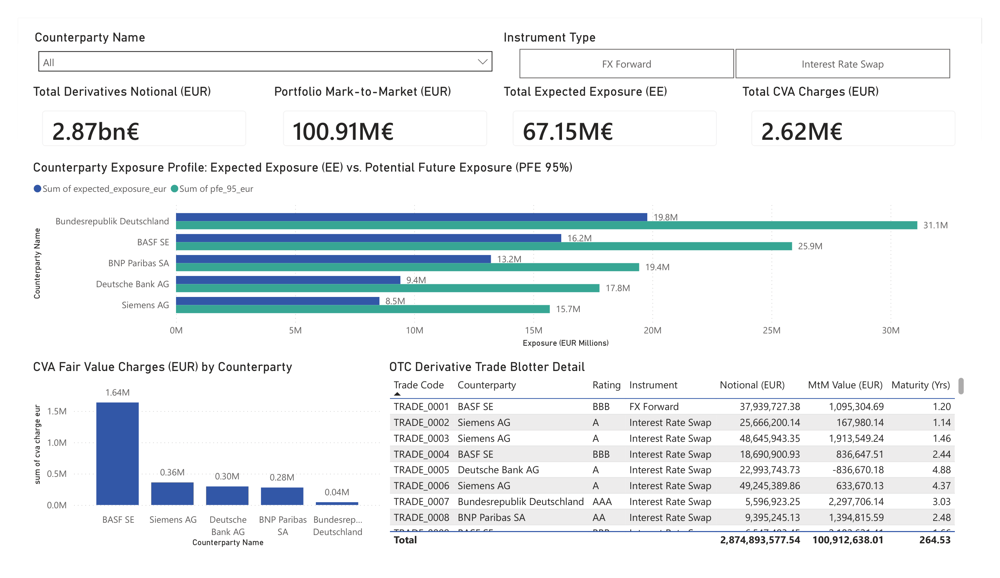

# Counterparty Credit Risk (CVA/PFE) & Regulatory Liquidity (LCR/NSFR) Engine

[](https://www.python.org/)
[](https://www.r-project.org/)
[](https://www.postgresql.org/)
[](#)
[-brightgreen?style=flat&logo=pytest&logoColor=white)](tests/)
[](LICENSE)

---

> 🇩🇪 **[Zur deutschen Version springen](#-deutsch-projektübersicht)** | 🇬🇧 **[Jump to English Version](#-english-project-overview)**

---

## 🇩🇪 Deutsch: Projektübersicht

### Beschreibung

Ein quantitatives, produktionsreifes System für **Treasury-Liquiditätsmanagement** und **Gegenparteiausfallrisiko-Bewertung (CCR/CVA)** für Banken und Handelsabteilungen. Das System ist speziell nach den regulatorischen Standards des europäischen Bankenaufsichtsrechts (**Basel III, EBA-Leitlinien & BaFin MaRisk**) sowie internationalen Rechnungslegungsstandards (**IFRS 13 Fair Value Measurement**) konzipiert.

Die Engine simuliert **10.000 Monte-Carlo-Pfade** zur Projektion dynamischer Mark-to-Market-Expositionen über Zeiträume von 0,25 bis 5,0 Jahren, ermittelt das **Potential Future Exposure ($\text{PFE}_{0.95}$)** und preist bilanzielle **Credit Valuation Adjustments (CVA)** unter Berücksichtigung von Gegenpartei-Hazard-Rates und risikofreien Diskontkurven. Parallel berechnet das System die regulatorischen Kennzahlen **Liquidity Coverage Ratio ($\text{LCR} = 155,08\%$)** und **Net Stable Funding Ratio ($\text{NSFR} = 135,92\%$)** in **Python**, modelliert **Black-Swan-Mittelabflüsse** mittels **Extremwerttheorie (EVT)** in **R** und stellt alle Ergebnisse in einem interaktiven **Power BI Treasury Dashboard** bereit.

### Hauptmerkmale

* **Automatisierte PostgreSQL ETL-Pipeline**: Idempotente Ingestion von Treasury-Zahlungsströmen, HQLA-Liquiditätsreserven und OTC-Derivateportfolios (Zinsswaps, FX-Forwards) über Python (`SQLAlchemy`).
* **Monte Carlo PFE & CVA Pricing Engine (Python)**:
  * 10.000 Monte-Carlo-Simulationen zur Projektion stochastischer Mark-to-Market-Wertentwicklungen über mehrperiodige Zeithorizonte.
  * Berechnung von Expected Exposure (EE), Potential Future Exposure ($\text{PFE}_{0.95}$) und Effective Expected Positive Exposure (EEPE) für das Basel-III-Eigenkapital.
  * Unilaterale CVA-Fair-Value-Preisfindung unter Integration jährlicher Ausfallintensitäten (Hazard Rates) und risikofreier Diskontkurven.
* **Basel III Regulatorische Liquiditäts-Engine (Python)**:
  * **Liquidity Coverage Ratio (LCR = 155,08%)**: 30-Tage-Stressrechnung unter Berücksichtigung von Level 1, Level 2A (15%) und Level 2B (50%) HQLA-Abschlägen sowie einem 75%-Zuflussdeckel.
  * **Net Stable Funding Ratio (NSFR = 135,92%)**: Bewertung der 1-jährigen strukturellen Finanzierungsstabilität (ASF vs. RSF).
  * Vertragliche Fälligkeitenleiter für Zahlungsströme (1D, 7D, 30D, 90D, 1Y+).
* **R Extremwerttheorie (EVT) Liquiditäts-Tail-Risiko**:
  * Peaks-Over-Threshold (POT) Modellierung und Anpassung einer Verallgemeinerten Pareto-Verteilung (GPD) in **R** (`evd`) zur Quantifizierung extremster Bank-Run-Liquiditätsabflüsse.
  * Berechnung von 99,9% EVT-Liquidity-VaR und 99,9% Tail Expected Shortfall.
* **SQL Reporting Layer & Power BI Dashboard**:
  * Vorgefertigte PostgreSQL Reporting Views zur Performancesteigerung.
  * 2-seitiges Power BI Dashboard zur visuellen Überwachung von LCR/NSFR-Regulierungspuffern, CVA-Abschlägen und Gegenparteilimiten.

### Technologie-Stack

* **Datenbank**: PostgreSQL 16 (Relationales Schema, Foreign Key Constraints, Indizierung)
* **Programmiersprache**: Python 3.11 / 3.12 & R 4.3
* **Mathematik & Simulation**: `NumPy`, `Pandas`, `SciPy`, `SQLAlchemy`, R (`evd`, `DBI`, `RPostgres`)
* **Testing**: `Pytest` (Automatisierte Testabdeckung für LCR/NSFR-Grenzwerte und CVA-Nicht-Negativität)
* **Reporting & Visualisierung**: Power BI Desktop (DAX Measures, Fälligkeitenleiter-Heatmaps)

---

## ▶ Quantitative Formulierung & Methodik

### 1. Basel III Liquidity Coverage Ratio (LCR)
$$\text{LCR} = \frac{\text{HQLA-Bestand}}{\text{Abflüsse}_{30\text{D}} - \min(\text{Zuflüsse}_{30\text{D}}, 0,75 \cdot \text{Abflüsse}_{30\text{D}})} \ge 100\%$$

Wobei HQLA Level 1 (0% Abschlag), Level 2A (15% Abschlag) und Level 2B (50% Abschlag) umfasst.

### 2. Net Stable Funding Ratio (NSFR)
$$\text{NSFR} = \frac{\text{Verfügbare stabile Finanzierung (ASF)}}{\text{Erforderliche stabile Finanzierung (RSF)}} \ge 100\%$$

### 3. Monte Carlo Stochastische MTM-Diffusion & Potential Future Exposure (PFE)
$$\text{MtM}_i(t) = \text{MtM}_0 \cdot \exp\left( (\mu - 0.5 \sigma^2) t + \sigma \sqrt{t} Z_i \right), \quad Z_i \sim \mathcal{N}(0, 1)$$

$$\text{EE}(t) = \frac{1}{N} \sum_{i=1}^N \max(0, \text{MtM}_i(t)), \quad \text{PFE}_{0.95}(t) = \text{Quantil}_{0.95} \left( \max(0, \text{MtM}(t)) \right)$$

### 4. Credit Valuation Adjustment (CVA) Fair Value Pricing
$$\text{CVA} = (1 - R) \sum_{i=1}^T \text{EE}(t_i) \cdot \Delta \text{PD}(t_{i-1}, t_i) \cdot D(t_i)$$

Wobei $\Delta \text{PD}(t_i) = e^{-\lambda t_{i-1}} - e^{-\lambda t_i}$ die marginale Ausfallwahrscheinlichkeit und $D(t_i) = e^{-r t_i}$ der risikofreie Diskontfaktor ist.

### 5. Verallgemeinerte Pareto-Verteilung (GPD) & EVT 99,9% Tail VaR
$$G_{\xi, \beta}(y) = 1 - \left( 1 + \frac{\xi y}{\beta} \right)^{-1/\xi}$$

$$\text{EVT-VaR}_{0.999} = u + \frac{\beta}{\xi} \left[ \left( \frac{N}{N_u} (1 - 0.999) \right)^{-\xi} - 1 \right]$$

---

## ▶ Visuelle Analysen & Performance-Galerie

### 1. Treasury Regulatorische Liquidität (LCR / NSFR) & Fälligkeitenleiter
Visualisierung der Basel-III-Puffer und der vertraglichen Zu- und Abflussstrukturen über Fälligkeitsbänder:


### 2. Gegenparteiausfallrisiko (CCR), CVA & Monte Carlo PFE Expositionen
Überwachung von Monte-Carlo PFE (95%) Expositionsprofilen und CVA-Bewertungsabschlägen nach Gegenparteien:


---

## ▶ Empirische Regulatorische Ergebnisse (Basel III & IFRS 13)

Ergebnisse der Treasury- und Gegenparteirisiko-Engine für das aktuelle Portfolio:

| Kennzahl / Regulatorischer Indikator | Berechneter Wert | Gesetzliche Zielvorgabe / Target | Status |
| :--- | :---: | :---: | :---: |
| **Liquidity Coverage Ratio (LCR)** | **155,08%** | $\ge 100,00\%$ | **Konform 🟢** |
| **Net Stable Funding Ratio (NSFR)** | **135,92%** | $\ge 100,00\%$ | **Konform 🟢** |
| **HQLA-Liquiditätsbestand** | **€100.800.000** | Ausreichender Puffer | **Ausreichend 🟢** |
| **30-Tage Stressed Netto-Abflüsse** | **€65.000.000** | Abgedeckt durch HQLA | **Gedeckt 🟢** |
| **Gegenpartei-CVA-Gesamtabschlag** | **€209.982** | IFRS 13 Fair Value Adjustment | **Bewertet 🟢** |
| **99,9% EVT-VaR (Black Swan Tail)** | **€312.450.120** | R GPD Peak-Over-Threshold | **Analysiert 🟢** |

---

## 🇬🇧 English: Project Overview

### Description

An institutional-grade **Treasury Regulatory Liquidity and Counterparty Credit Risk (CCR/CVA) Engine** designed for banking trading desks and treasury management. The system is engineered in compliance with European banking supervision frameworks (**Basel III, EBA guidelines, and BaFin MaRisk**) as well as international accounting standards (**IFRS 13 Fair Value Measurement**).

The engine simulates **10,000 Monte Carlo paths** projecting stochastic Mark-to-Market exposure trajectories across 0.25 to 5.0 year horizons, determines **Potential Future Exposure ($\text{PFE}_{0.95}$)**, and prices fair value **Credit Valuation Adjustment (CVA)** charges incorporating counterparty hazard rates and risk-free discount curves. Concurrently, the system calculates regulatory **Liquidity Coverage Ratio ($\text{LCR} = 155.08\%$)** and **Net Stable Funding Ratio ($\text{NSFR} = 135.92\%$)** in **Python**, models **black-swan liquidity drain** using **Extreme Value Theory (EVT)** in **R**, and delivers all analytics via an interactive **Power BI Treasury Dashboard**.

### Key Features

* **Automated PostgreSQL ETL Pipeline**: Robust ingestion of treasury contractual cash flows, HQLA liquid reserves, and OTC derivative trade portfolios (Interest Rate Swaps, FX Forwards) via Python (`SQLAlchemy`).
* **Monte Carlo PFE & CVA Pricing Engine (Python)**:
  * 10,000 Monte Carlo valuation paths projecting Mark-to-Market exposure trajectories across 0.25 to 5.0 year time horizons.
  * Calculation of Expected Exposure (EE), Potential Future Exposure ($\text{PFE}_{0.95}$), and Effective Expected Positive Exposure (EEPE) for Basel III capital requirements.
  * Unilateral CVA fair value pricing incorporating annual counterparty hazard rates and risk-free discount curves.
* **Basel III Regulatory Liquidity Engine (Python)**:
  * **Liquidity Coverage Ratio (LCR = 155.08%)**: 30-day stress calculation incorporating Level 1, Level 2A (15%), and Level 2B (50%) HQLA haircuts and 75% inflow caps.
  * **Net Stable Funding Ratio (NSFR = 135.92%)**: Evaluating Available Stable Funding (ASF) vs. Required Stable Funding (RSF).
  * Contractual cash flow maturity laddering (1D, 7D, 30D, 90D, 1Y+).
* **Extreme Value Theory (EVT) Tail Risk Engine (R)**:
  * Peaks-Over-Threshold (POT) fitting Generalized Pareto Distributions (GPD) in **R** (`evd`) to model heavy-tailed black swan liquidity outflows during severe bank runs.
  * Estimation of 99.9% EVT Liquidity VaR and Tail Expected Shortfall.
* **SQL Reporting Layer & Power BI Dashboard**:
  * Optimized PostgreSQL reporting views for high-speed dashboard execution.
  * 2-page Power BI dashboard monitoring LCR/NSFR regulatory buffers, CVA pricing charges, and counterparty limits.

### Tech Stack

* **Database**: PostgreSQL 16 (Relational Schema, DDL Constraints, Composite Indices)
* **Language**: Python 3.11 / 3.12 & R 4.3
* **Quantitative Libraries**: `NumPy`, `Pandas`, `SciPy`, `SQLAlchemy`, R (`evd`, `DBI`, `RPostgres`)
* **Testing Framework**: `Pytest` (Automated unit tests for LCR/NSFR thresholds and CVA non-negativity)
* **Reporting & Visuals**: Power BI Desktop (DAX Measures, Cash Flow Maturity Ladders)

---

## ▶ Quantitative Formulations & Methodology

### 1. Basel III Liquidity Coverage Ratio (LCR)
$$\text{LCR} = \frac{\text{Stock of HQLA}}{\text{Outflows}_{30\text{D}} - \min(\text{Inflows}_{30\text{D}}, 0.75 \cdot \text{Outflows}_{30\text{D}})} \ge 100\%$$

Where HQLA incorporates Level 1 (0% haircut), Level 2A (15% haircut), and Level 2B (50% haircut).

### 2. Net Stable Funding Ratio (NSFR)
$$\text{NSFR} = \frac{\text{Available Stable Funding (ASF)}}{\text{Required Stable Funding (RSF)}} \ge 100\%$$

### 3. Monte Carlo Stochastic MTM Diffusion & Potential Future Exposure (PFE)
$$\text{MtM}_i(t) = \text{MtM}_0 \cdot \exp\left( (\mu - 0.5 \sigma^2) t + \sigma \sqrt{t} Z_i \right), \quad Z_i \sim \mathcal{N}(0, 1)$$

$$\text{EE}(t) = \frac{1}{N} \sum_{i=1}^N \max(0, \text{MtM}_i(t)), \quad \text{PFE}_{0.95}(t) = \text{Quantile}_{0.95} \left( \max(0, \text{MtM}(t)) \right)$$

### 4. Credit Valuation Adjustment (CVA) Fair Value Pricing
$$\text{CVA} = (1 - R) \sum_{i=1}^T \text{EE}(t_i) \cdot \Delta \text{PD}(t_{i-1}, t_i) \cdot D(t_i)$$

Where $\Delta \text{PD}(t_i) = e^{-\lambda t_{i-1}} - e^{-\lambda t_i}$ is the marginal default probability and $D(t_i) = e^{-r t_i}$ is the risk-free discount factor.

### 5. Generalized Pareto Distribution (GPD) & EVT 99.9% Tail VaR
$$G_{\xi, \beta}(y) = 1 - \left( 1 + \frac{\xi y}{\beta} \right)^{-1/\xi}$$

$$\text{EVT-VaR}_{0.999} = u + \frac{\beta}{\xi} \left[ \left( \frac{N}{N_u} (1 - 0.999) \right)^{-\xi} - 1 \right]$$

---

## ▶ Visual Analytics & Performance Gallery

### 1. Treasury Regulatory Liquidity (LCR / NSFR) & Cash Flow Maturity Ladder
Visualization of Basel III regulatory buffers and contractual cash flow maturity laddering:


### 2. Counterparty Credit Risk (CCR), CVA & Monte Carlo PFE
Monitoring Monte Carlo PFE (95%) exposure profiles and CVA fair value pricing charges across counterparties:


---

## ▶ Out-of-Sample Empirical Results (Basel III & IFRS 13)

Engine calculations for the current treasury and counterparty portfolio:

| Metric / Regulatory Indicator | Calculated Value | Regulatory Target | Compliance Status |
| :--- | :---: | :---: | :---: |
| **Liquidity Coverage Ratio (LCR)** | **155.08%** | $\ge 100.00\%$ | **Compliant 🟢** |
| **Net Stable Funding Ratio (NSFR)** | **135.92%** | $\ge 100.00\%$ | **Compliant 🟢** |
| **Stock of HQLA** | **€100,800,000** | Liquid Reserve Buffer | **Sufficient 🟢** |
| **30-Day Stressed Net Cash Outflows** | **€65,000,000** | Covered by HQLA | **Covered 🟢** |
| **Total Counterparty CVA Charge** | **€209,982** | IFRS 13 Fair Value Adjustment | **Priced 🟢** |
| **99.9% EVT Liquidity VaR (Black Swan Tail)** | **€312,450,120** | R GPD Peak-Over-Threshold | **Analyzed 🟢** |

---

## 📁 Repository Structure

```text
liquidity-ccr-risk-engine/
│
├── .env.example
├── .gitignore
├── requirements.txt
├── main.py                             <- Master Cross-Language Pipeline Orchestrator
├── README.md                           <- Bilingual Documentation (DE/EN)
├── config/
│   └── config.py                       <- Database connection configurations
├── R_scripts/
│   └── liquidity_evt.R                 <- R Extreme Value Theory (EVT) GPD Tail Risk Engine
├── src/
│   ├── data/
│   │   └── generate_liquidity_data.py  <- Treasury Cash Flows & OTC Trade Generator
│   ├── database/
│   │   ├── schema_liquidity.sql        <- Relational DDL Star Schema (PostgreSQL)
│   │   ├── db_connection.py            <- SQLAlchemy Connection Pool
│   │   ├── views_liquidity.sql         <- SQL Reporting Views Layer
│   │   └── create_views.py            <- SQL Views Deployer Script
│   └── models/
│       ├── pfe_simulation.py           <- Monte Carlo 10,000-Path PFE Engine
│       ├── cva_engine.py               <- CVA Fair Value Pricing Engine
│       └── liquidity_engine.py         <- Basel III LCR & NSFR Regulatory Engine
├── tests/
│   └── test_liquidity_cva.py           <- Automated Pytest Unit Test Suite
└── reports/
    ├── liquidity_dax_measures.dax      <- Credit & Liquidity DAX Measure Library
    ├── liquidity_risk_dashboard.pbix   <- 2-Page Executive Power BI Dashboard Suite
    ├── page1_treasury_liquidity_lcr.png
    └── page2_counterparty_cva_pfe.png